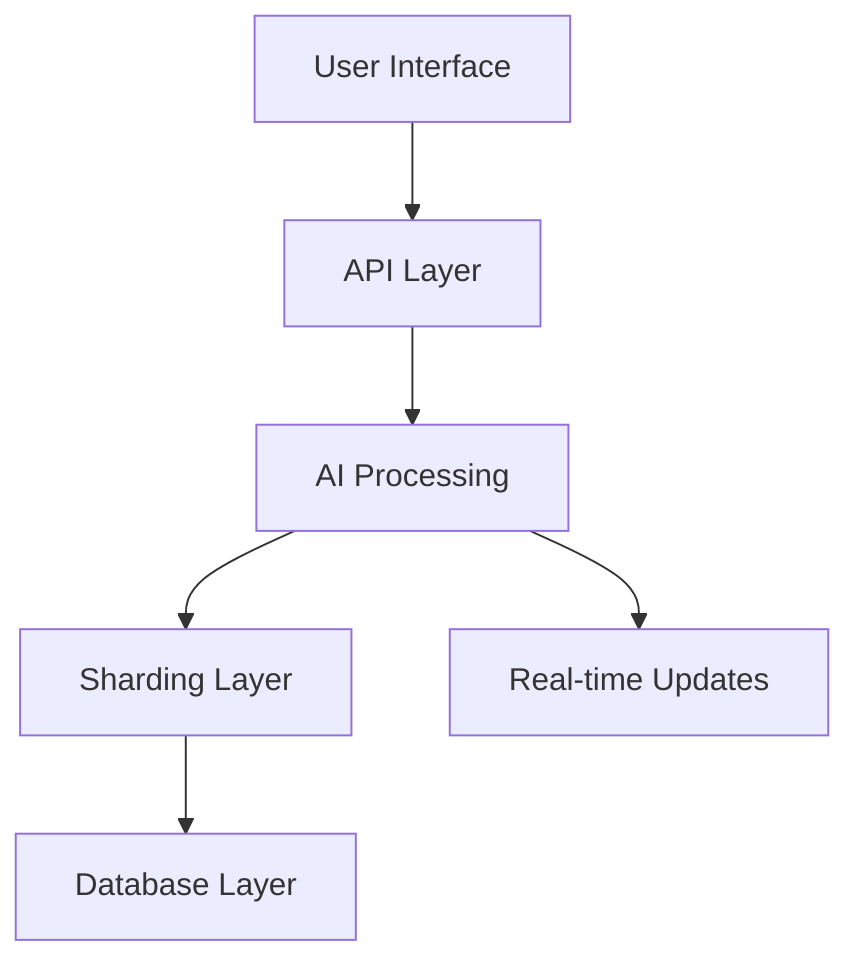

# 8thDegree Preview

Welcome to the preview repository for 8thDegree, an AI-powered freelancing platform. This repository provides a public preview of our platform's features and capabilities.

🔗 [View Live Preview](https://fairgigai.github.io/8thdegree-preview)

## Features

### 🤖 AI-Powered Matching
- Real-time job and freelancer matching
- Advanced bias detection and prevention
- Continuous learning and optimization
- Fair opportunity distribution

### 🔍 Smart Search & Discovery
- AI-enhanced semantic search
- Real-time recommendations
- Regional relevance optimization
- Personalized results

### ⚖️ Fair Platform
- Comprehensive bias detection
- Fair matching algorithms
- Success rate tracking
- Engagement optimization

### 🌍 Global Scale
- Region-aware matching
- Cross-region opportunities
- Real-time updates
- Distributed AI processing

## Technology Stack

### AI & ML
- OpenAI API
- Custom matching algorithms
- Bias detection models
- Learning systems

### Backend
- FastAPI
- PostgreSQL with AI-aware sharding
- Redis
- Elasticsearch

### Frontend
- Next.js 14
- TypeScript
- TailwindCSS
- WebSocket

## Architecture

Our platform is built on a modern, scalable architecture:

## Development Status

Current development status as of March 8, 2024:

✅ Core Infrastructure
- Database sharding
- Authentication system
- Development environment
- CI/CD pipelines

✅ AI Services
- Embedding generation
- Bias detection
- Matching engine
- Learning system

✅ Security & Compliance
- API authentication
- Rate limiting
- Input validation
- Security policies

🔄 In Progress
- Integration testing
- Performance testing
- Monitoring dashboards
- Deployment guides

## Coming Soon

1. Enhanced AI Features
   - Custom model training
   - Advanced bias detection
   - Cross-region support
   - Enhanced analytics

2. User Experience
   - Real-time notifications
   - Enhanced search
   - Mobile applications
   - Collaboration tools

## Contributing

This is a preview repository. For contribution opportunities, please visit our [main repository](https://github.com/FairGigAI/8thdegree).

## License

This project is licensed under the GPL-3.0 License - see the [LICENSE](LICENSE) file for details. 